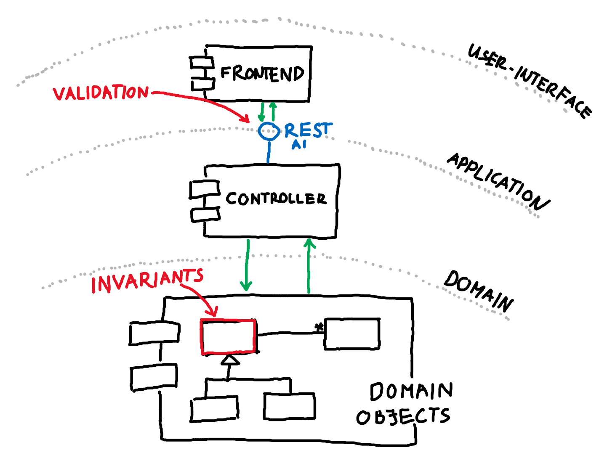
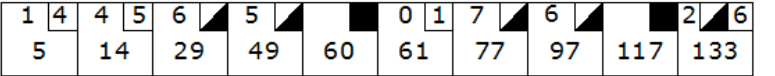
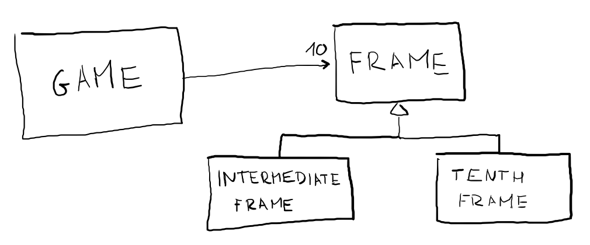

# Protect Your Invariants!

Developers tend to get confused, when they need to find a good place for their business logic. I suspect, that most probably the reasons are related to all those bad examples circulating around the documentations of the most commonly used frameworks and bad habbits coming from coding in old-fashioned enterprise platforms, like J2EE. Most of the time **they're afraid** keeping these important pieces of information in the language elements most relevant to the target domain: I'm talking about the simple classes reflecting the "nouns" of the business logic. Most often you see something like the example below.

```Java
@Entity 
public class ShoppingCart {
    @OneToMany
    private List<LineItems> lineItems;
    // getters and setters
}
```

```Java
@Component
public class ShoppingCartService {
    public void addToCart(ShoppingCart cart, LineItem item) {
        // Logic related to adding a line item to the shopping cart:
        // Preconditions to check, like availability of the item.
        // Operations, like really adding the item to the cart.
        // Postconditions and cleanup, like changing item's availabiltiy and transaction management.
    }
}
```

There's an entity, which is just a placeholder for the database state. It's also reflecting the object-database mapping with some sort of a meta-language, done by various annotations. There is nothing else here, just getters and setters. The real operations are done in another class that's suffixed as a "Service", "Processor" or a "Manager" (these name suffixes are some sort of an anti-pattern by themselves according to the book "Clean Code"). But from the framework's point of view these classes lifecycle are often controlled by the framework itself. Also meaning that it's preferabale not to hold state in the instances of the class: Either because The framework is keeping a single instance per class in some sort of a managed bean (simply as a singleton), or because multiple threads can access the instance's state at the same time, so thread safety is not guaranteed. 

Notice, that I have not talked about anyting related to the target domain. Nothing mentioned about the cart, capacity of the cart, the possibility of putting duplicated items of the cart, etc. But many things were explained related to framework concepts, like thread management, ORM, bean lifecycles and so on. So it's important to mention, that I suspect the framework documentations are intentionally keeping their examples like the one above. They need to minimize the amount code representing the "hard facts" of the domain in the example, because it's irrelevant!

So what's wrong with all of this? Simply the fact, that domain logic is not in focus and it's often scattered around in various places. Stateless operations are managing your domain by some sort of a ["transaction script"](https://www.martinfowler.com/eaaCatalog/transactionScript.html) leading us to an ["anemic domain model"](https://www.martinfowler.com/bliki/AnemicDomainModel.html). There's no place for the real power of Object-Oriented Programming in the form of polymorphism. Nor for really powerful deisgn-patterns, like composites, visitors, strategies, observers, and so on.

Sadly this is especially true if we want to implement some sort of an _invariant_ of the domain. These pieces of code are essential for keeping things together. Essential for keeping or defect density low, by cacthing programming errors early on. The _invariants_ of our domain should be part of a domain layer, unit-tested, and easy to understand. Not making them part of your domain will result more complicated test cases as you try to tailor together all your business logic from different layers or modules of your application. These tests will either run slower or have a complex mocking mechanism and a lot of plumbing code to make the application run without all the clutter. Not ideal if you really aim to understand functional behaivour by reading the test cases.

Should we put these invariants into our application boundaries in some sort of a validation logic? Maybe we could use another [framework or library](https://beanvalidation.org/2.0/) for our aid? I say we should put these implementations very close to our domain instead. Capture them with simple language elments that can be verified with a simple unit test.


_Invariants VS. validation: Often validation is placed on layer boundaries, while invariants are placed at the heart of your software_

## Defensive Programming, Design By Contract
To be honest, when I read about "Design by Contract" in the book ["The Pragmatic Programmer"](https://www.goodreads.com/book/show/4099.The_Pragmatic_Programmer), I got great fan of the subject. Unfortunately, I didn't find good support for it in Java so I just stopped experimenting with it. Later on I just dropped the burden of finding a good library for any kind of work and started implementing invariants and preconditions with simple language elements. Sometimes I formulated these as assertions, sometimes I just used some simplistic functions, but it always kept this kind of code close to the target domain. 

Later, I got familiar with Domain-Driven Design by reading Eric Evans' book. Inside he talked about "Making Implicit Concepts Explicit".That was the point, when I realized that invariants realted to the domain **should** be kept with the target domain and **should** be treated separately from handling possible programmer errors or misformatted input. For instance, a date format is something from the latter while handling important use-cases, like what happens if duplicated line items are put into a shopping cart, are the former.

## Two Examples (Bowling Game and Knight in a Chessboard)

OK, now let's look at two practical examples. In the [first one](https://kata-log.rocks/bowling-game-kata) we will implement a score evaluation software for a bowling game. The scoring rules can be explained in a few sentences, so I will just copy them over to here:

### Bowling Game Rules
#### The Game
_The game consists of 10 frames. In each frame the player has two rolls to knock down 10 pins._
_The score for the frame is the total number of pins knocked down, plus bonuses for strikes and spares._

#### Spares
_A spare is when the player knocks down all 10 pins in two rolls._ 
_The bonus for that frame is the number of pins knocked down by the next roll._

#### Strikes
_A strike is when the player knocks down all 10 pins on his first roll._ 
_The frame is then completed with a single roll. The bonus for that frame is the value of the next two rolls._

#### Tenth frame
_In the tenth frame a player who rolls a spare or strike is allowed to roll the extra balls to complete the frame._
_However, no more than three balls can be rolled in the tenth frame._

For those with poor imagination, here's a bowling scorecard. Spares are shown with black triangles and strikes with rectangles.


The rules seem simplistic, so we can start with something like an int array counting the number of scores. We can factor in the rest of the mentioned rules later (at least we think we can do it relatively easily). 

```java
public class Game {

    private int[] rolls = new int[21];
    private int turn = 0;

    public void roll(int pins) {
        rolls[turn++] = pins;
    }

    public int score() {
        return Arrays.stream(rolls).sum();
    }

}
```

Now let's collect the preconditions and invariants for the `roll()` method. 

- We can't roll more than 10 **pins** at once (physically impossible as there are only 10 pins at maximum on the field)
- Sum of **pins** we hit can be only 10 in each **frame**

There's a implicit concept which is not mentioned in the code above and it makes the implementation extremely hard to handle, and that's the **frame**. Now let's see preconditions and invariants related to **frames** in our business logic:

- On the tenth **frame** we can have either 2 or 3 **rolls** depending our current score in that **frame**.
- In first nine **frame** we can have 2 **rolls** at maximum.
- All of the above mentioned for the `roll()` method is also true, since we actually capture our current score in each frame in our scorecard.

Game should just ensure one thing:

- A **game** consists 10 **frames**. (this is captured implicitly with the [magic number](https://refactoring.guru/replace-magic-number-with-symbolic-constant) 21).

How should we represent **frame** in our code? We simply should make it explicit! This has the following positive effect in our implementation:

- Eliminates the hidden SRP violation starting to appear, as we try to do everything in a single `Game` class.
- Immediately eliminates the magic number `21` in our code.
- Helps readabiltiy by explicitly phrasing another "noun" of our doman, called **frame**.
- But most importantly **it's decomposing the problem to smaller subproblems that's easier to solve!**

Here's a diagram, that shows how our class hierarchy should look like.


So, how do we implement the `Game` class that encapsulates all its invariants? 

```java
public class Game {

    private Frame[] frames = new Frame[10];
    private int turn = 0;

    public Game() {
        // ...
    }

    public void roll(int pins) throws NoMoreRollsException, IllegalRollException {
        frames[turn].roll(pins);
        if (frames[turn].noMoreRolls()) {
            turn++;
        }
    }

    public int score() {
        return Arrays.stream(frames).mapToInt(Frame::score).sum();
    }

}
```

The line .. above is a pure representation of our first requirement: _"The game consists of 10 frames."_ Game does not need to know much more from anything else. The `roll()` and `score()` methods are just delegating functionalities to the appropriate `Frame` subclass.

Let's see how `roll()` method in the `Frame` implementation is dealing with preconditions and invariants:

```java
public class IntermediateFrame extends BaseFrame {

    private static final int FIRST_TRY = 0;
    private static final int MAXIMUM_TRIES = 2;
    // ...
    @Override
    public void roll(int pins) throws NoMoreRollsException, IllegalRollException {
        verifyNumberOfTriesIsLessThanMaximum(tries, MAXIMUM_TRIES);
        verifyNumberOfPinsIsLessThanMaximum(getFirstRoll() + pins);
        if (tries == FIRST_TRY) {
            setFirstRoll(pins);
        } else {
            setSecondRoll(pins);
        }
        tries++;
    } 
    // ...
}
```

Just to recap, we have to ensure, that:

- We can't roll more than 10 **pins** at once (physically impossible as there are only 10 pins at maximum on the field)
- Sum of **pins** we hit can be only 10 in each **frame**.
- In the first nine **frame** we can have 2 **rolls** at maximum.

All of the above is encapsulated in just two lines.

### Knight on a Chessboard

I once saw the following [hard interviewing assignment](https://afteracademy.com/blog/knight-on-chessboard). If you get an excercise like that and you are inexperienced, you will probably block because of the overwhelming complexity of the problem. (Then you probably start right in the middle and end up troubleshooting all your bugs in an overcomplicated multi-nested for loop in the last 20 minutes of the interview.) 

Object-Oriented thinking should be on our aid! Only thing that we have to do is to split the problem into feasible subproblems and  protect our invariants (you can imagine it as some sort of a synonym to encapsulation). This ensures good OOP design from the bottom-up and save a lot of time.

#### Working With What We Know

Let's brainstorm together a couple of invariants:

* A chess piece should remain on the board after each step.
* A knight is allowed to move two squares vertically and one square horizontally, or two squares horizontally and one square vertically (from [Wikipedia](https://en.wikipedia.org/wiki/Knight_%28chess%29#Movement)).

These are still too high-level and not simplistic enough to work with. How should we express the first one with multiple invariants?

* A position in the chessboard is formed of ranks and files.
* A chess piece on the board occupies one single position.


```java
public final class Position {

    private final Rank rank;
    private final File file;

    public Position(Rank rank, File file) {
        this.rank = rank;
        this.file = file;
    }
    // ...
}
```

```java
public final class Knight {

    private final Position currentPosition;
    
    public Knight(Position position) {
        this.position = position;
    }

}
```

Now, for the sake of simplicity let's assume that we're playing with a standard 8x8 chessboard. Each rank and file can be represented with enums in this case: 

```java
public enum Rank {
    A, B, C, D, E, F, G, H;
    // ...
}

public enum File {
    ONE, TWO, THREE, FOUR, FIVE, SIX, SEVEN, EIGHT;
    // ...
}
```

To guarantee the first invariant all that we have to do is to implement a method which will move our piece to a new location:
```java
class Position {
    // ...
    public Position advance(int rankChange, int fileChange) throws IllegalMoveException {
        return new Position(getRank().advance(rankChange),
                getFile().advance(fileChange));
    }
    // ...
}

class Rank {
    // ..
    public Rank advance(int steps) throws IllegalMoveException {
        try {
            return Rank.values()[this.ordinal() + steps];
        } catch (ArrayIndexOutOfBoundsException ex) {
            throw new IllegalMoveException();
        }
    }
}
```

All that's happening is we're changing the existing interface of the Java enum to align it with our domain. We have introduced the `advance` and the `IllegalMoveException` terms to our design. 


#### Why Aren't We Using Coordinates?

As a sidenote let's discuss less powerful designs. At least less powerful from the scope of forcing our invariants.
What if we use just two ints inside our `Knight` class?

```java
public class Knight {

    private final int file;
    private final int rank;

    public Knight(int file, int rank) {
        this.file = file;
        this.rank = rank;
    }
    // ...
}
```

In this case we need to check if the `file` and `rank` fields are between 1 and 8 (or 0 - 7) after moving our piece. This logic can't be placed inside the `Knight` class, because it's going to break the "Single Responisbility Principle": What if we need to extend our codebase with additional pieces? The invariant has to be enforced in each and every step for each and every piece. We can't just copy over the validaiton code to other pieces and neither can we extend `int` functionalities. So there has to be a new class encapsulating this logic, that's associated with all the chess pieces somehow. Let's put the coordinates into the `Position` class:

```java
public class Position {
    private final int file;
    private final int rank;

    public Position(int file, int rank) {
        this.file = file;
        this.rank = rank;
    }
    // ...
}
```

This style is a bit better. We have to guarantee that each `Position` object is well constructed, meaning both `file` and `rank` values are in range. We could do something like the example below, but this would mean that every constructor call will possibly throw an exception:

```java
public class Position {
    // ...
    public Position(int rank, int file) throws IllegalMoveException {
        assertWithingRange(rank);
        assertWithingRange(file);
        this.rank = rank;
        this.file = file;
    }
    // ...

```

Enums offer a possible range of values that can be predefined with a declarative style. This relieves us of the burden of exception handling in every object creation.

#### Coding the Algorithm

A `Knight` should tell the set of positions it is allowed to visit. We need to implement this method relying on the existing mechanism. Something like the snippet below should work:

```java
public class Knight {
    // ...
    Set<Position> getPossibleMoves() {
        var result = new HashSet<Position>();
        addPositionIfPossible(result, 1, 2);
        addPositionIfPossible(result, 1, -2);
        addPositionIfPossible(result, 2, 1);
        addPositionIfPossible(result, 2, -1);
        addPositionIfPossible(result, -1, 2);
        addPositionIfPossible(result, -1, -2);
        addPositionIfPossible(result, -2, 1);
        addPositionIfPossible(result, -2, -1);
        return result;
    }

    private void addPositionIfPossible(HashSet<Position> result, int rankChange, int fileChange) {
        try {
            result.add(position.advance(rankChange, fileChange));
        } catch (IllegalMoveException e) {
        }
    }
    // ...
}
```

The method `addPositionIfPossible` is not quite nice, because it swallows an exception and modifies the passed parameter's state. If you prefer to eliminate these issues in method implementation you can refactor the snippet above after changing `Position.advance()`  to return an `Optional<Position>`.

```java
public class Knight {
    // ...
    Set<Position> getPossibleMoves() {
        var result = new HashSet<Position>();
        position.advance(1, 2).ifPresent(result::add);
        position.advance(1, -2).ifPresent(result::add);
        position.advance(2, 1).ifPresent(result::add);
        position.advance(2, -1).ifPresent(result::add);
        position.advance(-1, 2).ifPresent(result::add);
        position.advance(-1, -2).ifPresent(result::add);
        position.advance(-2, 1).ifPresent(result::add);
        position.advance(-2, -1).ifPresent(result::add);
        return result;
    }
    // ...
}
```

OK, now let's head for the implementation of the algorithm after we've solved all the subproblems above. We need some Java collections in place to track our current progress of the traversal. Let's try to nail them and implement them.

* We need to track the positions we've already traversed with our Knight (can be a set).
* All possible moves should be enqueued, so we can investigate those one-by-one (ideal candidate for a queue).
* We track the steps required in a separate collection which maps each position on the chessboard with an integer (a map of course).

``` java
public class KnightSolver {
    private final Knight knight;
    private final Set<Position> seen = new HashSet<>();
    private final Queue<Position> candidates = new LinkedList<>();
    private final Map<Position, Integer> stepsNeeded = new HashMap<>();
    // ...
}
```

In each iteration we're visiting the first element of the `candidates` queue. Let's list the steps we need to do:

1. Get the possible moves from that position
2. Remove all the possible moves which we've already seen
3. Update our `stepsNeeded` collection with the newly discovered possible moves
4. Update the set of already `seen` positions
5. Update the traversable `candidates` with the newly discovered possible moves (for the subsequent iterations)
6. **Of course, return the result if we reached to the end position**

And this is how it should look:

```java
public class KnightSolver {
    //...
    public int maxStepsFor(Position endPosition) {
        initialize();
        while (!candidates.isEmpty()) {
            var currentKnight = new Knight(candidates.poll());
            var positions = currentKnight.getPossibleMoves();
            positions.removeAll(seen);
            for (var position : positions) {
                stepsNeeded.put(position, stepsNeeded.get(currentKnight.getPosition()) + 1);
                if (endPosition.equals(position)) {
                    return stepsNeeded.get(endPosition);
                }
                seen.addAll(positions);
                candidates.add(position);
            }
        }
        throw new RuntimeException("Should not be possible");
    }
    //...
}
```

You can view the full code example over here: https://github.com/gitaroktato/knight-shortest-path-example

## Conclusion

// TODO DDD book assertions, validation, constrains and policies
// TODO language flaws of the technique, especially inheritance. Template method, make methods with guard clauses final!
// TODO Microservices with shallow domain. Very simple domain.
If you're interested, you can watch me [on YouTube](https://www.youtube.com/watch?v=gxxKPhuw4e8) doing the bowling game implementation step-by-step using TDD. 